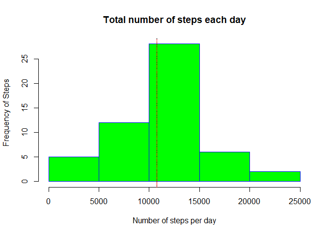
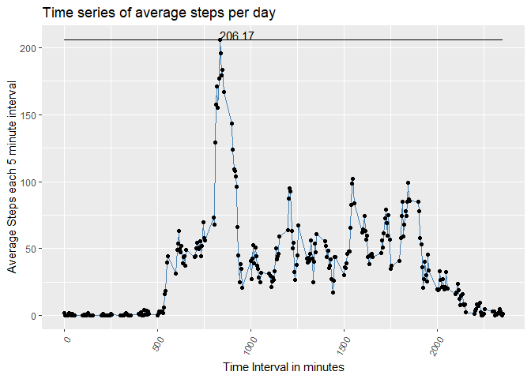
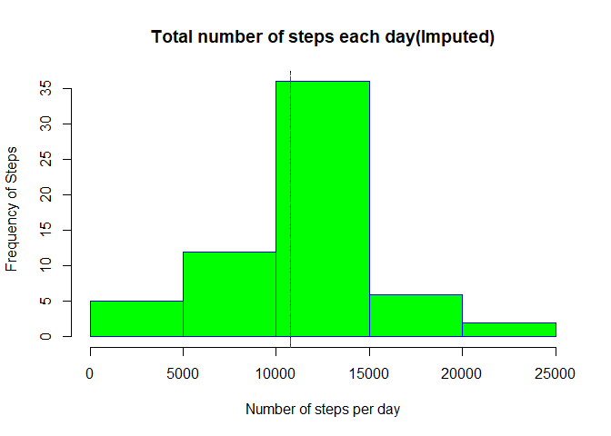
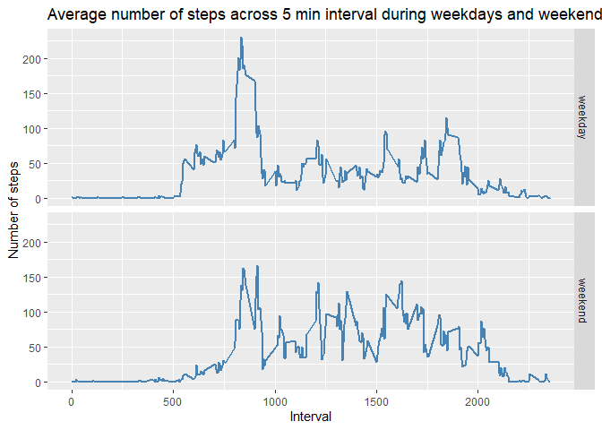

## Activity Analysis 

This Document focusses on how to analyse the Step Data collected in a personal monitoring device for an anonymous individual for 2 months ( October and November 2012) for every 5 minute interval.

Lets first work on reading the data from the files and loading into R.  

### Code for reading in the dataset and/or processing the data
 

```r
#Load this data into steps Data frame in R

steps <- read.csv('activity.csv')

#converting to Date
steps$date <- as.Date(steps$date)
#17568 observations, 3 columns
```

### Histogram of the total number of steps taken each day ( Mean and Median)
Let us now plot the histogram of total number of steps taken each day. This gives us an interpretation of number of steps frequency over the time period.

This can be done using the R code below :


```r
#Mean and Median calculation per day
steps <- read.csv('activity.csv')

steps$date <- as.Date(steps$date)
#DF
#First make a new Data Frame by grouping by Date and summing the steps per date


steps_mean_median <- steps %>%
    group_by(date) %>%
    summarise(tot_steps=sum(steps),mean_steps=mean(steps,na.rm=TRUE),median_steps= median(steps[steps>0]))


steps_mean_median <- na.omit(steps_mean_median)
#view(steps_mean_median)
totalmean <- as.integer(mean(steps_mean_median$tot_steps))
totalmedian <- median(steps_mean_median$tot_steps)

#showing it again in the histogram plot
hist(steps_mean_median$tot_steps,col="green", main="Total number of steps each day", xlab="Number of steps per day",border="blue", ylab="Frequency of Steps")
abline(v=totalmean, lty=5, col="black")   
abline(v=totalmedian, lty=6, col="red")  
```

<!-- -->

The total mean computed is 10766 .
The total  median computed is 10765.

### Time series plot

Here let us plot using the data set got above on the time series plot of average number of steps taken each day . We can also plot the the 5-minute interval that, on average, contains the maximum number of steps.


```r
steps <- na.omit(steps)
#view(steps) # 15264 entries 

steps_avg_time <- steps %>%
  group_by(interval) %>%
  summarise(mean_steps=mean(steps,na.rm=TRUE))


p <- ggplot(steps_avg_time, aes(x=interval, y=mean_steps)) +
    xlab("Time Interval in minutes") +
    ylab("Average Steps each 5 minute interval") +
    ggtitle("Time series of average steps per day")+
  geom_line( color="steelblue") + 
    geom_point() +
    theme(axis.text.x=element_text(angle=60, hjust=1)) +
 geom_line(aes(interval,max(mean_steps))) +
  geom_text(aes(label=ifelse(mean_steps>200,round(mean_steps,2),'')),hjust=0,vjust=0)
  #geom_abline(v=max(mean_steps),lty=3,color="red")
  #stat_summary(fun.y = max(mean_steps), colour = "orange", geom = "point", size = 5)
  
p
```

<!-- -->

### Histogram of the total number of steps taken each day after missing values are imputed
Let us plot the histogram of total number of steps  with the imputed data. For this purpose Iam starting fresh and redoing from the initial data set .The mechanism used here to impute missing data is [Mean imputation ][1]  

[1]:  https://lgreski.github.io/datasciencedepot/references/missingValueImputation-Gelman.PDF "Title" 

We take the mean of the observed values for that variable ( for that specific interval) and populate that in the missing place.


```r
#Load this data into steps Data frame in R

steps <- read.csv('activity.csv')

steps$date <- as.Date(steps$date)


# Data grouped by Interval and calculating mean per interval of 5 minutes
steps_avg_time <- steps %>%
    group_by(interval) %>%
    summarise(mean_steps=mean(steps,na.rm=TRUE))

#Merge the two data sets 
merged <- merge(steps, steps_avg_time)

# Final_steps column will have the steps value or mean(steps) if NA in initial data set
merged$final_steps <- ifelse(is.na(merged$steps), round(merged$mean_steps,2),merged$steps) #GN

#Final imputed data set
new_steps <- merged[,c("interval","date","final_steps")]


#rename the final_steps column to steps 
new_steps <- rename(new_steps, steps=final_steps)

#Replot the histogram, median and mean using the new imputed data set

#First make a new Data Frame by grouping by Date and summing the steps per date
steps_new_day <- new_steps %>%
    group_by(date) %>%
    summarise(num_steps=sum(steps))


steps_new_mean_median <- new_steps %>%
  group_by(date) %>%
  summarise(tot_steps=sum(steps),mean_steps=mean(steps,na.rm=TRUE),median_steps= median(steps[steps>0]))


total_new_mean <- as.integer(mean(steps_new_mean_median$tot_steps))
total_new_median <- as.integer(median(steps_new_mean_median$tot_steps))


hist(steps_new_mean_median$tot_steps,col="green", main="Total number of steps each day(Imputed)", xlab="Number of steps per day",border="blue", ylab="Frequency of Steps")
abline(v=total_new_mean, lty=5, col="black")   
abline(v=total_new_median, lty=6, col="red")  
```

<!-- -->


From the imputed data set, we can see that the total mean computed is 10766 and the total  median computed is 10766. 

Conclusion: When we impute the missing values in the data set, the mean and median match the original data set.The total number of steps now imputed for all date intervals having NA values is the same as the median value.


###  Panel plot comparing the average number of steps taken per 5-minute interval across weekdays and weekends


```r
steps <- read.csv('activity.csv')

steps$date <- as.Date(steps$date)


# Data grouped by Interval and calculating mean per interval of 5 minutes
steps_avg_time <- steps %>%
    group_by(interval) %>%
    summarise(mean_steps=mean(steps,na.rm=TRUE))

#Merge the two data sets 
merged <- merge(steps, steps_avg_time)

# Final_steps column will have the steps value or mean(steps) if NA in initial data set
merged$final_steps <- ifelse(is.na(merged$steps), round(merged$mean_steps,2),as.integer(merged$steps))

#Final imputed data set
new_steps <- merged[,c("interval","date","final_steps")]


new_steps$day <- weekdays(as.Date(new_steps$date), abbr=TRUE)
#Label weekday and weekend
for (i in 1:nrow(new_steps)) {                                     
    if (new_steps[i,]$day %in% c("Sat","Sun")) {            
        new_steps[i,]$day<-"weekend"                         
    }
    else{
        new_steps[i,]$day<-"weekday"                        
    }
    
}

#Average steps taken per 5 minute interval across weekdays and weekends

steps_avg_td <- new_steps %>%
    group_by(interval,day) %>%
    #  summarise(mean_steps=round(mean(steps,na.rm=TRUE),2))
    summarise(mean_steps=round(mean(final_steps),2))


#Make a time series panel plot
ggplot( data= steps_avg_td, aes(interval,mean_steps))+
    geom_line(color="steelblue",size=1)+
    labs(title ="Average number of steps across 5 min interval during weekdays and weekends ",
         y="Number of steps",
         x="Interval")+
    facet_grid(day ~.)
```

<!-- -->
From the panel plot we can see that the individual walks highest number of steps per interval only on weekdays , while in weekends the average number of steps per interval is higher than weekdays.
This is the conclusion of this assignment and hope you enjoyed it.

###  References
1.  http://uc-r.github.io/na_exclude
2.  https://www.datacamp.com/community/tutorials/make-histogram-basic-r
3.  https://www.coursera.org/learn/reproducible-research/discussions/weeks/2/threads/Ja5pLkkFEeag-Q7qt7iPGQ/replies/OyOi60k-Eeag-Q7qt7iPGQ
4.  https://www.r-graph-gallery.com/279-plotting-time-series-with-ggplot2.html
5.  https://intellipaat.com/community/7380/label-points-in-geompoint
6.  https://rdrr.io/cran/lessR/man/Merge.html
7.  https://stackoverflow.com/questions/33104456/divide-time-series-data-into-weekday-and-weekend-datasets-using-r
8.  http://zevross.com/blog/2019/04/02/easy-multi-panel-plots-in-r-using-facet_wrap-and-facet_grid-from-ggplot2/#our-first-plot-number-of-character-appearances-by-year
9.  https://github.com/lgreski/datasciencectacontent/blob/master/markdown/repData-configuringKnitrWithMarkdownOutput.md


##**THE END**
